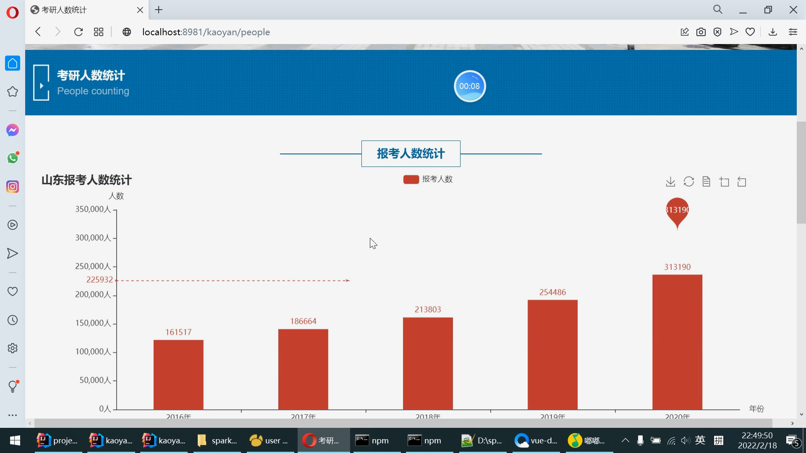
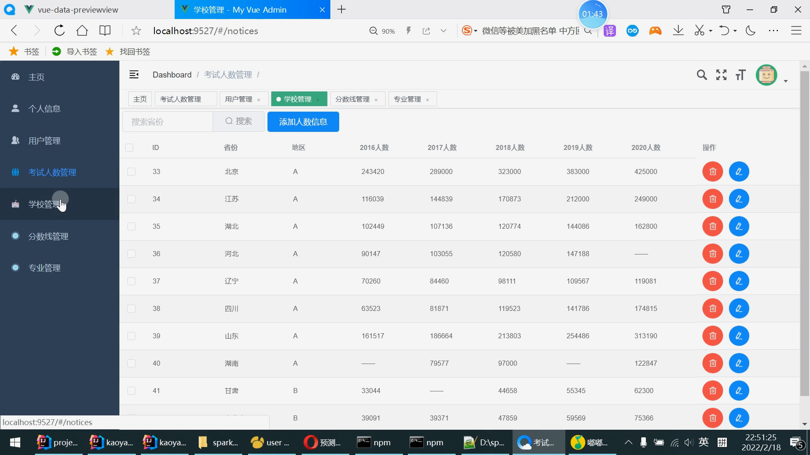

# 计算机毕业设计之Spark+Flink+Python考研预测分析 考研院校推荐系统 考研大数据分析大屏 大数据毕业设计

## 要求
### 源码有偿！一套(论文 PPT 源码+sql脚本)

https://www.bilibili.com/video/BV12m4y197JM?spm_id_from=333.999.0.0

### 

### 加好友前帮忙start一下，并备注github有偿获取源码
### 我的QQ号是2877135669 或者 1679232425
### 加qq好友说明（被部分 网友整得心力交瘁）：
    1.加好友务必按照格式备注
    2.避免浪费各自的时间！
    3.当“客服”不容易，repo 主是体面人，不爆粗，性格好，文明人。

## 开发技术
Hadoop、Spark、Flink、SparkSQL、Python、MySQL、协同过滤算法、echarts、k-means预测算法

# 功能描述

1 协同过滤

这边由于学校内的专业分数信息不全，所以推荐出来学校，下面可能是看不到专业的分数信息的。

2 大屏

基于spark和flink的实现，flink是 kaoyan-flink 项目运行后会把统计结果存在mysql中， 然后kaoyan-server 项目可以获取数据给vue的大屏kaoyan-bigscreen

3 系统后端

kaoyan-admin 实现了系统内表的crud操作。

 

 

 

# 系统创新点

大屏统计可视化

Python预测算法

Flink+Spark组合分析

协同过滤推荐算法

# 运行截图

# 运行视频(B站)

https://www.bilibili.com/video/BV12m4y197JM?spm_id_from=333.999.0.0

